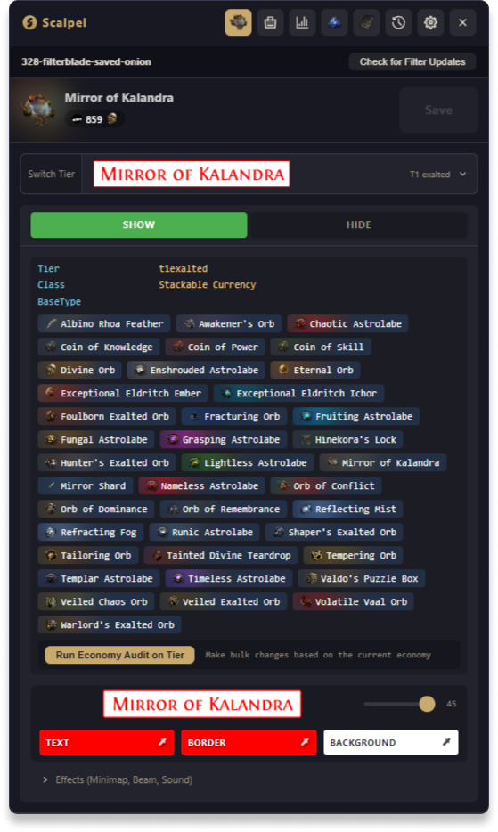
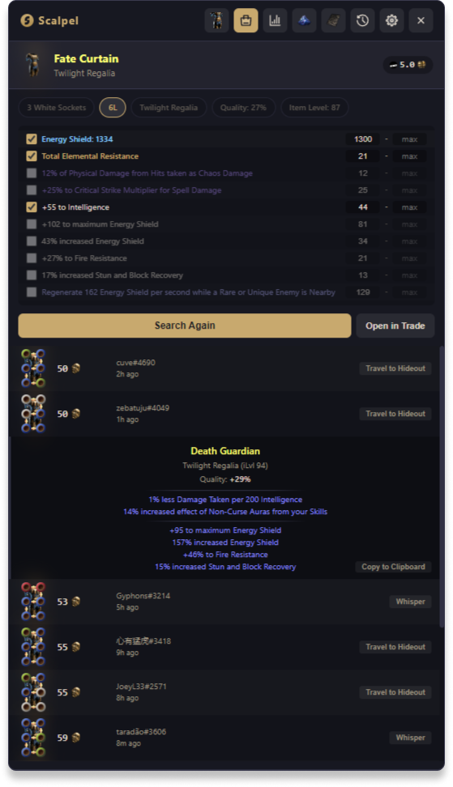
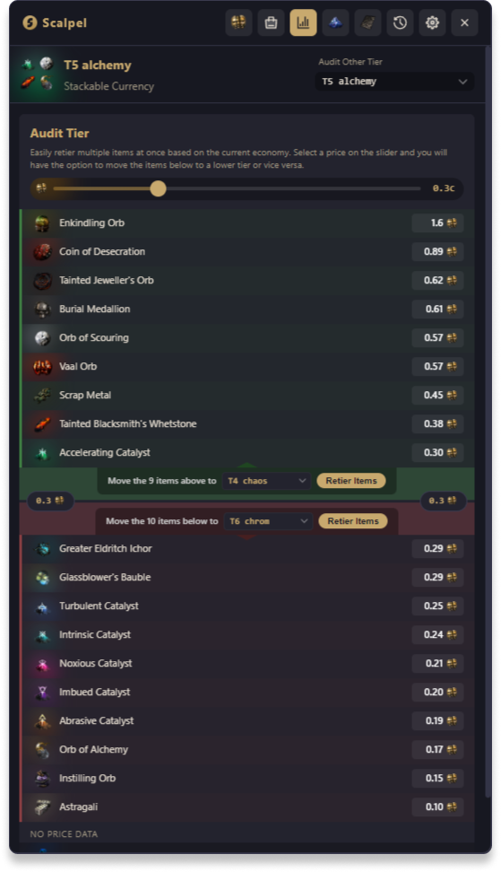
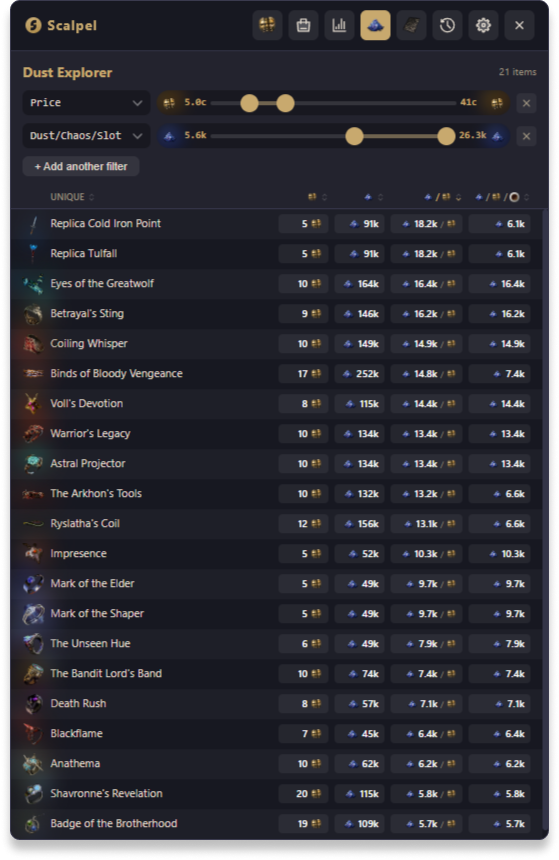
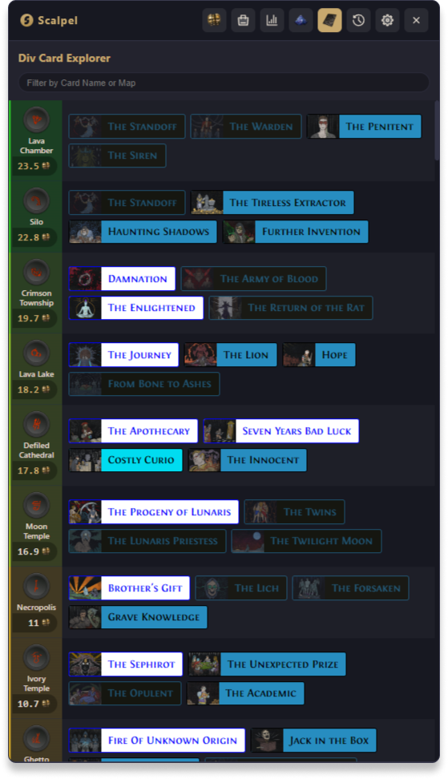
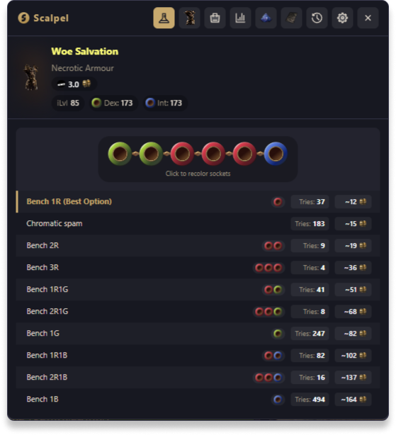

# Scalpel

Path of Exile's first ever fourth-party tool. An overlay to edit your filter, price check items, and tons more.

## Features

- **Filter Editor** - Edit your loot filter in-game quickly and precisely (like a Scalpel, get it)
- **Price Checker** - A price checker that works like you'd expect, when it works. But better. Sometimes.
- **Economy Audit** - Bulk retier items based on current market prices from poe.ninja
- **Dust Explorer** - Easily filter uniques to find the best ones to dust
- **Div Card Explorer** - EV calculator for div cards on maps with live prices (s/o [Maps of Exile](https://github.com/deathbeam/maps-of-exile) and the Forbidden Library)
- **Socket Recolor** - Easily calculate cost of recoloring sockets on items
- **Online Filter Sync** - Use and update your FilterBlade filter like you always do, with the speed of local edits.
- **Chat Hotkeys** - Create chat macros for hideout etc.
- **And more** - Scrollable stash tabs, filter checkpoints etc.

## Requirements

- Windows 10+ (Linux soon)
- You're okay being an early adopter (Some of this ain't work good)

## Official Releases

Pre-built releases are available on the [Releases](https://github.com/scalpelpoe/scalpel/releases) page.

## FAQ

[FAQ](https://scalpel.fourth.party/faq)

## Notes from Fred

Scalpel is now open source. If you like Scalpel and have feedback, the Discord to do that is below. This app is in beta right now and it acts like it some times. Let me know and I will fix it, and if I can't handle it, maybe someone else can. Here is what I am working on next:

- Regex creation and saving
- Fixing all the item lines that don't work in the price checker
- Trying to fix the overlay layering and making it not show up outside of the game
- Adding an item search so you don't need to have the item handy to use Scalpel for it
- Fixing all the bugs. There is an end to bugs right? Eventually you run out.

## Discord

[Hopefully this link works](https://discord.com/channels/967418738402029705/1481740906385113222)

## Screenshots

| | |
|---|---|
|  |  |
|  |  |
|  |  |

## Contributing

I'll keep PRs open until I can't manage it anymore. I don't care if you use AI tools to assist you with your work, be efficient, more power to you - I just don't want to sift through openclaw slop instead of building Scalpel.

Here are some things I need help with

- Linux support (Keyboard stuff is broken)
- Localization (All the Spanish I know is from watching Narcos)
- If you find item affixes that break in price checker (This is 50% of what is wrong with Scalpel)

## Building from Source

This is an electron app - why? I just know it better than other options. You can decide if I know it well or not. 

Running it is easy:

```
npm install
npm run dev
```

## License

This project is licensed under the [GNU Affero General Public License v3.0](LICENSE).

## Third-Party Software

Check out [Third Party Notices](THIRD-PARTY-NOTICES.md) for the homies that make the libaries that make apps like Scalpel possible.
